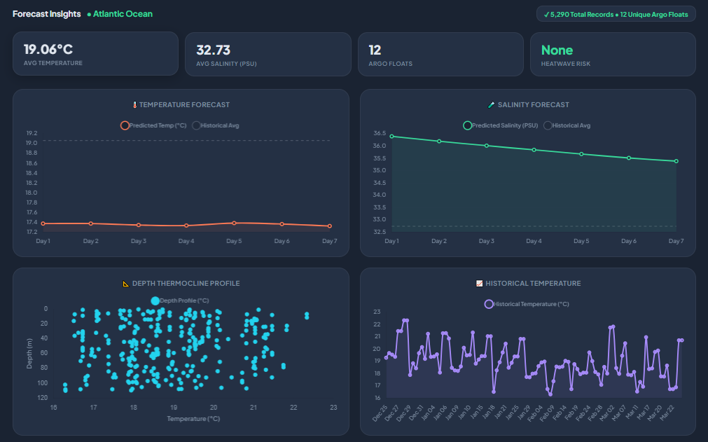
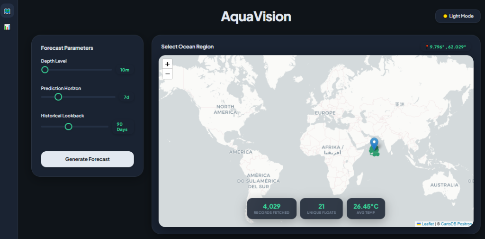

# 🌊 AquaVision — Ocean & Climate Intelligence Platform

A full-stack AI-powered web application for **global ocean prediction** using live Argo float data from IFREMER ERDDAP.





---

## ✨ Features

- **Global Ocean Forecasting** — Click anywhere on the world map to generate temperature & salinity forecasts
- **Live ARGO Data** — Pulls real-time data from IFREMER's ERDDAP database (no mock data)
- **Machine Learning Analytics** — Uses Scikit-Learn (Polynomial Ridge Regression) for accurate, localized time-series forecasting
- **Environmental Risk Engine** — Real-time assessment for Marine Heatwaves, Hurricane Intensification, Coral Bleaching, and Fishing Zone Suitability
- **Advanced 6-Chart Dashboard** — Forecasts, Historical Traces, and Depth Profiles (Thermocline & Halocline) for comprehensive insight
- **Auto-Expanding Search** — Dynamically widens the search radius to find nearby float data automatically
- **Reverse Geocoding** — Labels forecast results with the geographic ocean/region name
- **Dark / Light Mode** — Premium polished UI with toggleable persisted preferences

---

## 🏗️ Architecture

```
AquaVision/
├── backend/
│   ├── main.py              # FastAPI server — data fetching, prediction, heatwave logic
│   └── requirements.txt     # Python dependencies
├── frontend/
│   └── src/
│       ├── App.jsx           # Main app — controls, state management, API calls
│       ├── components/
│       │   ├── MapComponent.jsx   # Interactive Leaflet world map
│       │   └── Dashboard.jsx      # Charts (Chart.js), heatwave banners, stats
│       ├── index.css         # Global styles — dark/light themes, responsive design
│       └── main.jsx          # React entry point
├── start_backend.bat         # One-click backend launcher
└── start_frontend.bat        # One-click frontend launcher
```

---

## 🛠️ Tech Stack

| Layer | Technologies |
|-------|-------------|
| **Frontend** | React, Vite, Leaflet.js, Chart.js, Axios |
| **Backend** | FastAPI, Uvicorn |
| **Data & ML** | Scikit-Learn (Ridge Regression), Pandas, NumPy, IFREMER ERDDAP |
| **Styling** | Custom CSS, Plus Jakarta Sans, Glassmorphism UI |

---

## 🚀 Setup & Run

### Prerequisites
- Python 3.8+
- Node.js v18+

### Launch

**1. Start the Backend**
Double-click `start_backend.bat` or run from terminal.
→ API available at **https://aquavision-abj8.onrender.com**

**2. Start the Frontend**
Double-click `start_frontend.bat` or run from terminal.
→ UI available at **http://localhost:5173**

**3. Open your browser** and navigate to `http://localhost:5173`

---

## 📖 How It Works

1. **Select a location** — Click anywhere on the interactive global ocean map
2. **Configure parameters** — Set depth (0–2000m), prediction horizon (1–30 days), and historical lookback (30–180 days)
3. **Generate Forecast** — The backend fetches live ARGO float data from the selected region.
4. **Machine Learning Pipeline** — A localized `scikit-learn` regressor dynamically fits the massive float history to project rigorous, data-driven temperature and salinity curve forecasts.
5. **View Results** — Interactive charts display forecasts, depth profiles, historical data, and complex environmental risk assessments.
